# Язык программирования TypeScript

Првиет, Даша. В этом уроке, "ты освоишь новый язык программирования, под названием TypeScript"

Конечно, понимаю, что ты сейчас такая: "Ааааа, пиздец, Сергей. Какой ещё новый язык". но ты не парься, все очень просто

# TypeScript - это язык программирования, который придумали какие-то умные челики из Microsoft, дабы внести в JavaScript типизацию.

Помнишь, в уроке 7 херню "NaN" - Not a Number. Когда ты забирала значени инпутов, но прога не понимала, что там именно, числа =(

# TypeScript компилятор
Сам TypeScript это не только язык программирования (синтаксические правила, кстати крайне понятные и легкие, особенно если синтаксис js уже знаешь, а ты его знаешь), это так же компилятор. Все, что делает компилятор - это кушает код из файликов .ts и превращает их в уже знакомые тебе файлики .js

В рамках урока сама увидишь))

# Некоторые примеры
Например, у нас есть функция sum, которая берет 2 переменных и складывает их, именно 2 переменные, а не числа.
Если я вызову её с параметрами 111 и 222, то она вернет 333, очевидно.
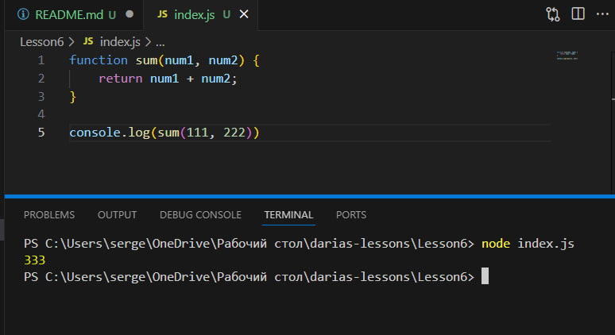
Но если я воткукну, в неё "111" и "222", то бишь строки, то она вернет мне сумму этих строк (конкатенацию), а именно 111222
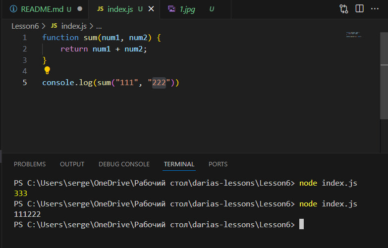
Подобная тема у нас была, в уроке 5. Кстати, пользователь в твоей программке может вводить не всегда цифры, если ты это предусмотрела и добавила какую-то валидацию, то ты молодец.

Короче, прикол в том, чтобы гарантировать мне, как разработчику функции sum, что она будет возвращать сумму чисел, мне надо всяко изгаляться и геморроить прям в этой функции, по типу такого
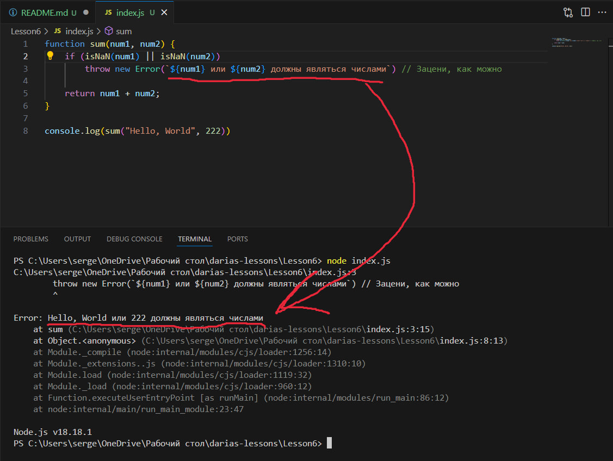
Прикольно я тут вставил значения прямо в строку, да?)
Это называется интерполяция. Чтобы её заюзать, надо вместо простых или двойных кавычек юзать кавычки из апострофов и внутри писать так ${название_переменной}. Кстати, не знал о существовании функции isNaN(), но как обычно нагуглил и тут же поумнел на 0.000000001%
При этом, если я засуну в функцию числа, то ошибку программа не выкинет
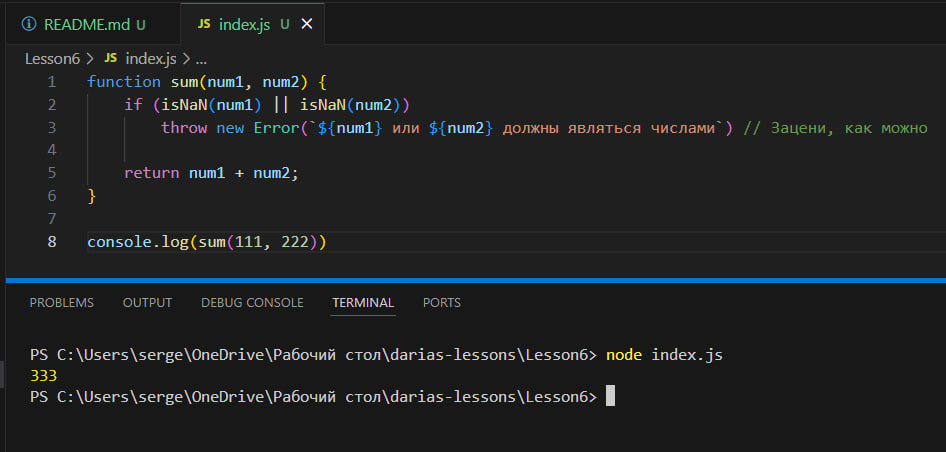
Но в чем прикол, я, как разработчик, всякий раз, когда пишу код, зависящий от типов, мне надо париться и проверять, где число, бля а где строка и так далее. Конечно пример я привел лайтовый, но это тяжко короче. И если я знаю о существовании TypeScript, то я всю эту ебань делегировать ему и немножко изменить код. И так зацени

Я

- В коде убрал проверку типов 
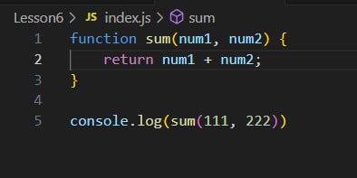
- Изменил расширения файла с .js на .ts
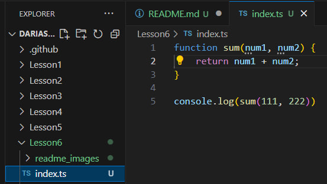
- Теперь я собираюсь этот файли index.ts скормить компилятору TypeScript

Выполним команду npm i typescript -g --save-dev
-g - флаг, который говорит, что эта зависимость глобальная. Она не будет складываться в папку node_modules нашего проекта, она будет у нас на компьютере
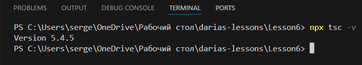
Вот скачался, теперь у нас есть typescript версии 5.4.5
- Ваполняем команду "npx tsc --init" для инициализации проекта
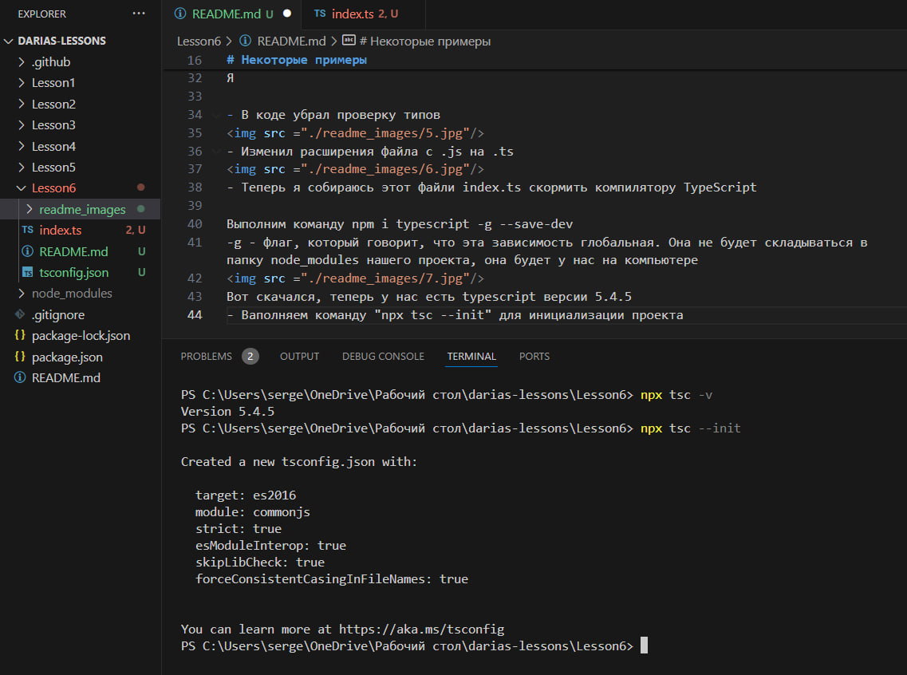
После выполнения команды, в папке у нас появляется конфигурационный файлик "tsconfig.json"
там всякая ерунда написана, для настроек компилятора в них пока лезть не будем
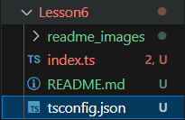
 
Теперь выполним команду для компиляции "npx tsc index.ts" и посмотрим, что из этого выйдет
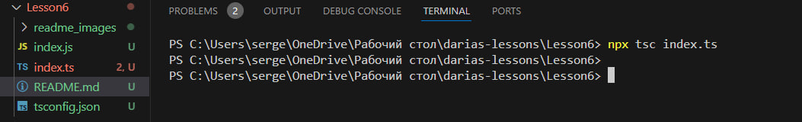
Хоба, магия у нас появился .js файлик, который создал TypeScript
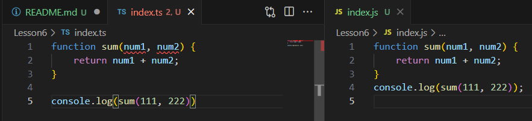
Можно заметить, что они абсолютно идентичные, а все потому, что язык TypeScript так синтаксически похож на JavaScript, что в частном случае является им же. И внутри TypeScript`а можно на самом деле просто херачит на js.
Но видно ещё кое-что, в файле .ts, у на что-то ругается на аргументы функции
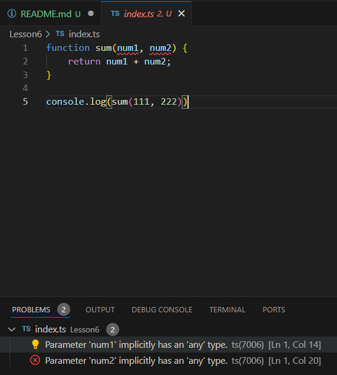
А во вкладке "PROBLEMS" даже есть пояснение, что у параметров пропущено указание типов, но ниче добавим сейчас
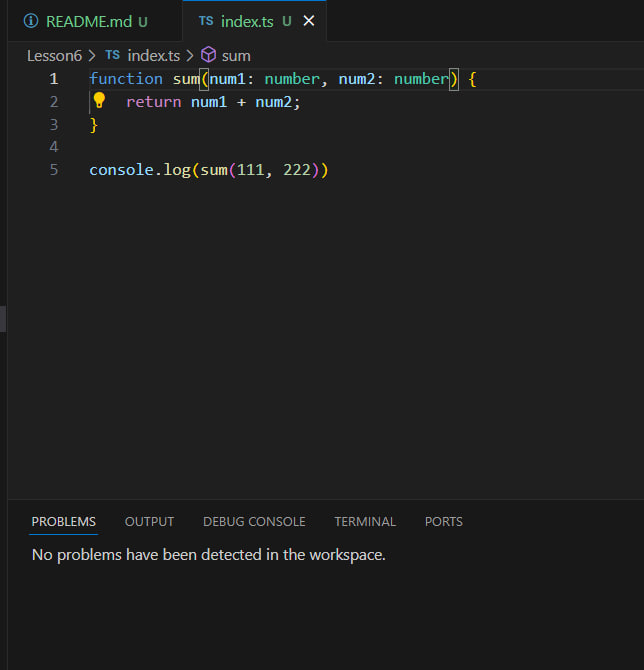
Добавили и ругань от компилятора ушла)
Кстати, теперь typescript нам помешает вызвать эту функцию, передав туда НЕ числа. Как-то так работает ts. Теперь к заданию, оно будет в файле index.ts

- P.S: Отличительной особенностью этого урока будет отсутствие тестов. А работа будет считаться выполненной, когда я не смогу прикопаться. Хехехех. Тут, Даше нужно будет по чаще пушить. Удачи тебе!