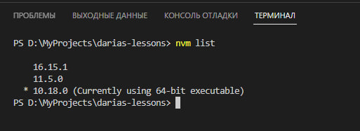
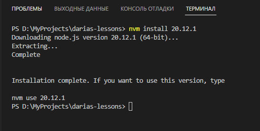
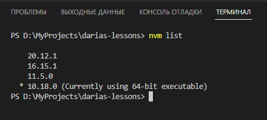
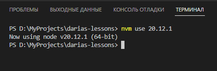
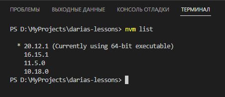

# Вот это да!!!
# Ты уже тут!!!

Я очень надеюсь, что тебе нравится заниматься тем, чем мы занимаемся Ещё надеюсь, что ты ловишь какое-то просветление, когда получается сделать так, чтобы "ОНО" работало. Надо идти дальше и теперь мы будем изучать
<a href="https://v3.ru.vuejs.org/">Vue.js 3</a>

# Предисловие
Это файл README_1.md. Я буду делать такие ридмишки к каждому новому уроку. Теперь задания будут более комплексными. И код ревью будет тщательным. Будет чуть-чуть сложнее, но и интереснее. Теперь, в рамках одного урока, не нужно будет разработать всего одну функцию. Теперь мы будем за определенное количество итераци пилить минимально рабочее приложение и первым таким приложением будет "TO-DO LIST"

# TO-DO LIST
Приложение для ведения заметок и задач на определенный период. Ну типа - 

Я сегодня должен:
- попукать
- покушать
- попукать
- покушать
- попукать
- покушать
- попукать
- покушать

# Как оно будет?
Оно будет так, как ты решишь. Ты будешь в роли разработчика. Я буду в роли тех. лида, который тебе всегда поможет и в роли PO (Product Owner) - чувак, который постоянно просит новые фичи)

Начнем с изучения Vue.js 3, а точнее с его усановки, настройки и создания первого проекта.
* Скачаем Node.js посвежее, а то мало ли. Скачаем "20.12.1"
    + Либо через nv, если он у нас установлен

    

    

    

    

    

    + Либо, если на nvm ругается, то качаем <a href="https://nodejs.org/en">отсюда</a>
